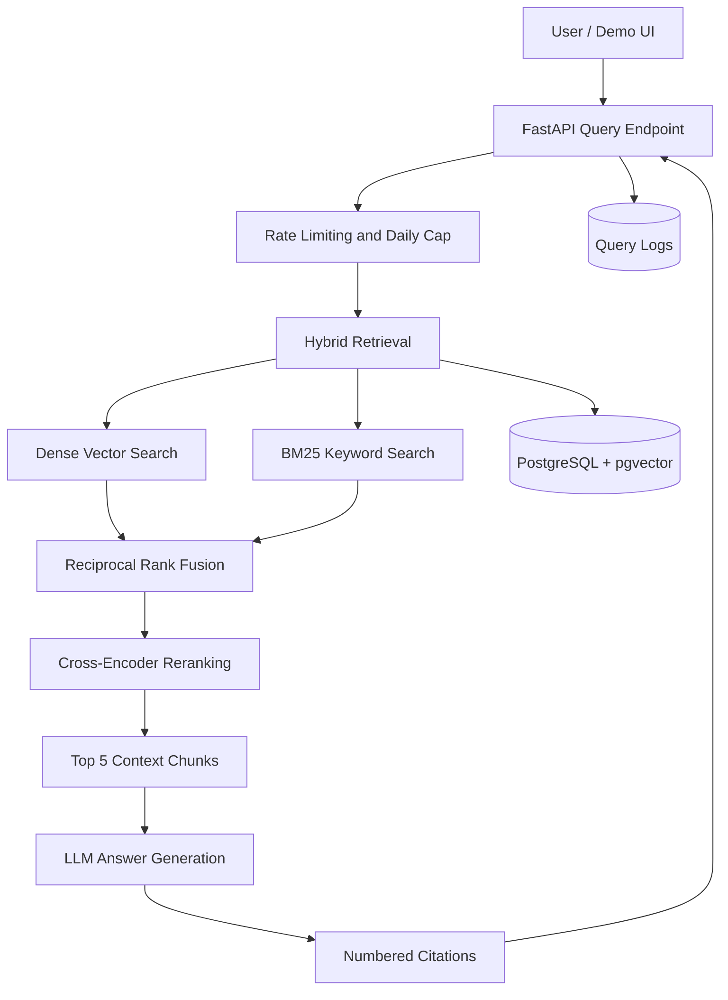

# Enterprise RAG Reliability Platform

**An evaluation-driven Retrieval-Augmented Generation (RAG) system for SEC 10-K filings, focused on retrieval quality, citation reliability, hallucination risks, and failure analysis.**

The platform answers questions about corporate financial filings using hybrid retrieval, Reciprocal Rank Fusion (RRF), cross-encoder reranking, and citation-grounded generation. When the indexed filings do not contain sufficient evidence, the system is designed to respond:

> I could not find this in the provided filings.

The goal is not just to build a RAG chatbot. It is to understand where a RAG pipeline fails, measure its behavior, and validate improvements through reproducible experiments.

## Contents

* [Key Features](#key-features)
* [Architecture](#architecture)
* [Tech Stack](#tech-stack)
* [Dataset](#dataset)
* [Evaluation Results](#evaluation-results)
* [Failure Analysis](#failure-analysis)
* [Limitations](#limitations)
* [Getting Started](#getting-started)
* [Testing and Evaluation](#testing-and-evaluation)
* [Repository Structure](#repository-structure)
* [Roadmap](#roadmap)
* [Project Status](#project-status)

## Key Features

* **Hybrid retrieval:** Combines dense vector search with BM25 keyword search.
* **Reciprocal Rank Fusion:** Merges rankings from complementary retrieval methods.
* **Cross-encoder reranking:** Reorders retrieved candidates before generation.
* **Citation-grounded answers:** Produces numbered citations with previews of the supporting text.
* **Company and fiscal-year selection:** Identifies the relevant company and selects the requested filing year or the newest available filing.
* **Abstention behavior:** Refuses questions when the provided filings do not support an answer.
* **Request observability:** Logs questions, retrieved chunks, retrieval scores, answers, cost, and latency.
* **Evaluation-driven development:** Measures retrieval performance and records known failure cases.
* **API protection:** Includes per-IP rate limiting and a daily request cap.
* **Containerized infrastructure:** Uses Docker Compose with PostgreSQL and pgvector.

## Architecture

<!-- ARCHITECTURE DIAGRAM PLACEHOLDER

Add your architecture diagram here.

Recommended location: docs/images/architecture.png

After adding the image, replace this comment with:


-->

<!-- Optional: Keep this Mermaid diagram if you prefer a diagram rendered directly by GitHub. -->



**Request flow**

1. The API receives a question and applies request limits.
2. Dense vector search and BM25 retrieve relevant filing passages.
3. Reciprocal Rank Fusion combines the candidate rankings.
4. A cross-encoder reranks the candidates.
5. The top five chunks are passed to the LLM for answer generation.
6. The response includes numbered citations, and request details are logged for evaluation and debugging.

Experimental context packing has also been evaluated separately. It is not enabled in the current production retrieval configuration.

## Tech Stack

| Component              | Technology                                                  |
| ---------------------- | ----------------------------------------------------------- |
| API framework          | FastAPI                                                     |
| Database               | PostgreSQL 16                                               |
| Vector search          | pgvector                                                    |
| ORM                    | SQLAlchemy 2                                                |
| Embeddings             | `all-MiniLM-L6-v2` — 384 dimensions                         |
| Keyword retrieval      | `rank-bm25`                                                 |
| Cross-encoder reranker | `ms-marco-MiniLM-L-6-v2`                                    |
| LLM inference          | OpenAI-compatible API via CraftX, using `gpt-oss-120b`      |
| Infrastructure         | Docker Compose                                              |
| Evaluation             | Custom golden-set evaluation scripts and saved JSON results |

## Dataset

The platform indexes **13 SEC 10-K filings across seven companies**:

`AAPL` · `MSFT` · `NVDA` · `TSLA` · `WMT` · `JPM` · `PFE`

| Dataset characteristic                  |  Value |
| --------------------------------------- | -----: |
| Indexed filings                         |     13 |
| Companies                               |      7 |
| Indexed text chunks                     | 10,628 |
| Golden evaluation questions             |     20 |
| Questions with scored retrieval results |     16 |

The golden set contains:

* 8 numeric questions
* 8 narrative questions
* 4 questions that the filings cannot answer

The evaluation separates retrieval quality from answer-generation behavior so that retrieval failures and generation failures can be investigated independently.

## Evaluation Results

### 1. Retrieval Quality

The retrieval evaluation uses 16 scored questions from the 20-question golden set.

The following table compares the current production retrieval configuration with alternative retrieval and context-packing experiments.

| Configuration                                     |     Hit@1 |     Hit@5 |       MRR |
| ------------------------------------------------- | --------: | --------: | --------: |
| Production — top 5 chunks                         |     0.375 |     0.625 |     0.466 |
| Production baseline — reranked top 10             |     0.375 |     0.625 |     0.503 |
| Unpacked control — top 10, 6,000-character budget |     0.375 |     0.625 |     0.503 |
| Packed context — top 10, 6,000-character budget   | **0.375** | **0.875** | **0.537** |

**Metrics**

* **Hit@1:** The proportion of questions for which a relevant result appears at rank 1.
* **Hit@5:** The proportion of questions for which a relevant result appears within the top 5.
* **MRR (Mean Reciprocal Rank):** Measures how highly the first relevant result is ranked.

**Key findings**

* Context packing increased Hit@5 from **0.625 to 0.875**, equivalent to 10/16 versus 14/16 questions.
* MRR increased from **0.503 to 0.537** compared with the unpacked control.
* Hit@1 remained unchanged at 0.375 (6/16 questions).
* Four questions gained a relevant result within the top five positions.
* Packing did not lower the relevant-result rank for any of the four questions where rank changed.
* Packed context used an average of 5,510 characters, compared with 5,703 for the unpacked control.
* Apple FY2025 revenue and Microsoft FY2026 net income remained retrieval misses across all tested configurations.

The results suggest that context packing can improve the placement of relevant evidence within the retrieval results. However, the evaluation covers only 16 questions, so the improvement is directional rather than statistically conclusive.

#### Questions improved by context packing

| Question                               | Control rank | Packed rank |
| -------------------------------------- | -----------: | ----------: |
| Tesla revenue — `tsla-rev-2025`        |            7 |           5 |
| NVIDIA revenue — `nvda-rev-fy2026`     |            7 |           2 |
| Apple supply risk — `aapl-supply-risk` |            7 |           5 |
| Walmart segments — `wmt-segments`      |            6 |           4 |

These cases show that packing improved the ranking of relevant evidence without changing Hit@1. The NVIDIA question saw the largest rank improvement, moving from position 7 to position 2.

**Saved evaluation artifacts**

| Experiment       | File                                                                                              |
| ---------------- | ------------------------------------------------------------------------------------------------- |
| Baseline recheck | [`20261008_211316_recheck.json`](eval/results/20261008_211316_recheck.json)                       |
| Unpacked control | [`20261008_213822_control_top10.json`](eval/results/20261008_213822_control_top10.json)           |
| Packed context   | [`20261008_213510_packed_top10_fixed.json`](eval/results/20261008_213510_packed_top10_fixed.json) |

Commit all three JSON files to the repository so the comparison and experiment references remain reproducible.

### 2. Answer Quality and Abstention

The separate answer-level evaluation suite contains 10 questions.

| Evaluation category                                 |                   Result |
| --------------------------------------------------- | -----------------------: |
| Answerable questions answered correctly             |                      3/3 |
| Questions absent from the filings correctly refused |                      4/4 |
| Known retrieval misses correctly refused            |                      2/2 |
| JPM total-assets question                           | Inconsistent across runs |

The three correctly answered questions covered Tesla revenue, the Autopilot verdict, and Walmart segments.

The system also refused all four questions whose answers were absent from the filings and both known retrieval misses. This demonstrates useful abstention behavior in the tested cases, although it does not establish general reliability.

#### A known financial-answer failure

The JPM total-assets question exposes an important limitation. In some runs, the model returned **43,295 million**, a variable-interest-entity total, instead of the correct consolidated total of **4,424,900 million**.

The generated answer included a real citation and sounded confident despite selecting the wrong financial figure. The answer was correct in approximately three out of five runs.

This illustrates why citation presence alone does not guarantee answer correctness: the cited source may be real while the selected value is inappropriate for the question.

**Evaluation scope:** These answer-level results come from a small test suite. They should be treated as diagnostic observations, not as a general accuracy estimate.

## Failure Analysis

Documenting failure cases is a core part of the project. The following issues were observed during implementation and evaluation.

### Retrieval failures

* **Financial-table retrieval:** Apple FY2025 revenue and Microsoft FY2026 net income appear in financial-table rows that the retriever fails to surface. The system refuses these questions rather than inventing values, but it still fails to answer questions whose information exists in the source documents.
* **Incomplete section extraction:** A section-splitting bug caused Microsoft content to be under-indexed. After the fix, its chunk count increased from 96 to 619.
* **HTML-cleaning artifacts:** Text processing sometimes joins adjacent words, producing artifacts such as `ofour`, and leaves some section labels inconsistent.
* **Unreliable relevance thresholds:** An unanswerable Cybertruck revenue question scored higher than some correctly retrieved answers. Reranker scores alone are therefore insufficient for a reliable abstention threshold.

### Generation and verification failures

* **Ambiguous financial labels:** Multiple figures can share similar labels in the same filing. The model may select the wrong value while citing a genuine source.
* **Inconsistent outputs:** Temperature 0 does not eliminate answer variation across runs with the current LLM provider.
* **Failed verification:** The LLM verifier approved a known incorrect answer in all 12 tested attempts. Verification remains disabled because it did not demonstrate reliable error detection.
* **Unproven answer-level benefits from packing:** Context packing improved retrieval metrics, but retrieval gains alone do not establish better generated answers. It remains experimental until answer-level evaluation demonstrates a benefit.

The project's engineering decisions and experiments are documented in [`docs/decisions.md`](docs/decisions.md).

## Limitations

* **Small evaluation set:** Retrieval results are based on 16 scored questions; answer-level evaluation covers 10 questions.
* **Oracle company selection:** The retrieval evaluation supplies the correct company, so it does not fully measure company identification in real user queries.
* **Financial-table extraction:** Table structure and row-level relationships are not reliably preserved.
* **No reliable answer verifier:** Verification is disabled because the current implementation failed its known-error test.
* **LLM provider dependency:** CraftX outages can cause request failures, although cached answers may remain available.
* **Single-worker assumptions:** Caching and rate limiting are in-process and are not coordinated across multiple workers.
* **Uneven document structure:** Filing sections are not indexed consistently across all companies; JPM content is grouped under a single item heading.
* **Incomplete consistency guarantees:** Repeated queries may produce different answers even at temperature 0.
* **Experimental packing:** Context packing has demonstrated retrieval-level gains, but answer-level improvements remain unverified.

## Getting Started

### Prerequisites

* Docker Desktop with Docker Compose
* Python 3.13
* A CraftX API key
* An appropriate SEC User-Agent value for EDGAR data access

### 1. Clone the repository

```bash
git clone <YOUR_GITHUB_REPOSITORY_URL>
cd <YOUR_REPOSITORY_DIRECTORY>
```

Replace the placeholders with your repository URL and directory name.

### 2. Configure environment variables

```bash
cp .env.example .env
```

Configure the required values in `.env`:

```dotenv
POSTGRES_PASSWORD=your_database_password
CRAFTX_API_KEY=your_craftx_api_key
SEC_USER_AGENT=YourName your.email@example.com
```

Use your own credentials. Never commit `.env` or expose API keys in screenshots, logs, or source control.

### 3. Start PostgreSQL

```bash
docker compose up -d db
```

### 4. Initialize the database

```bash
python -m scripts.init_db
```

### 5. Download and ingest filings

```bash
python -m scripts.download_edgar
python -m scripts.ingest
```

The download step requires the configured SEC User-Agent. Ingestion processes the filing data and populates the database for retrieval.

### 6. Start the API

```bash
docker compose up -d --build api
```

Open the following URLs after the service starts:

* **Demo UI:** http://127.0.0.1:8000
* **API documentation:** http://127.0.0.1:8000/docs

## Testing and Evaluation

### Run the test suite

```bash
python -m pytest tests -v
```

### Evaluate retrieval methods

```bash
python -m scripts.run_eval --mode all --label baseline
```

Review the saved results in `eval/results/` and the engineering rationale in [`docs/decisions.md`](docs/decisions.md).

The committed evaluation artifacts allow future changes to be compared against a documented baseline.

## Repository Structure

```text
.
├── app/
│   ├── services/
│   │   ├── retrieval.py     # Dense, BM25, hybrid and reranked search
│   │   ├── generation.py    # Prompting, citations and verification
│   │   ├── packing.py       # Experimental context packing
│   │   └── cache.py         # Answer cache
│   └── core/
│       └── ratelimit.py     # Per-IP rate limit and daily cap
├── scripts/                 # Ingestion and evaluation scripts
├── eval/
│   └── results/              # Saved evaluation runs
├── docs/
│   ├── decisions.md          # Engineering decisions and experiments
│   └── images/
│       └── architecture.png  # Add your architecture diagram here
└── README.md
```

This tree highlights the main project components; it is not intended to list every repository file.

## Roadmap

* [ ] Improve financial-table parsing and row-aware retrieval.
* [ ] Improve disambiguation of consolidated financial figures and similarly labeled values.
* [ ] Build a verifier that reliably catches known incorrect answers.
* [ ] Expand the golden set and add regression tests for known failures.
* [ ] Evaluate answer quality across repeated runs and retrieval configurations.
* [ ] Test company identification without supplying the correct company to the evaluator.
* [ ] Validate whether context packing improves answer-level quality.
* [ ] Make caching and rate limiting safe for multi-worker deployments.
* [ ] Deploy the application and add reproducible demo examples.

## Project Status

**Current status:** Working locally · Not deployed

The platform has a functioning retrieval and generation pipeline, request logging, and an initial evaluation workflow. Its main challenges are financial-table retrieval, numeric answer reliability, and the limited size of its evaluation suite.

### Demo

**Architecture diagram**

<!-- Replace with your actual image after adding docs/images/architecture.png. -->


**Application screenshots**

<!-- Add screenshots here after capturing the running application. -->

| Citation-grounded answer                                | Unsupported-question refusal                                |
| ------------------------------------------------------- | ----------------------------------------------------------- |
| <!-- Add screenshot: docs/images/answer-example.png --> | <!-- Add screenshot: docs/images/abstention-example.png --> |

**Live demo:** Not deployed.

---

**Project focus:** Building a more reliable RAG system through measurable retrieval experiments, citation-grounded generation, reproducible evaluation, and transparent failure analysis.
